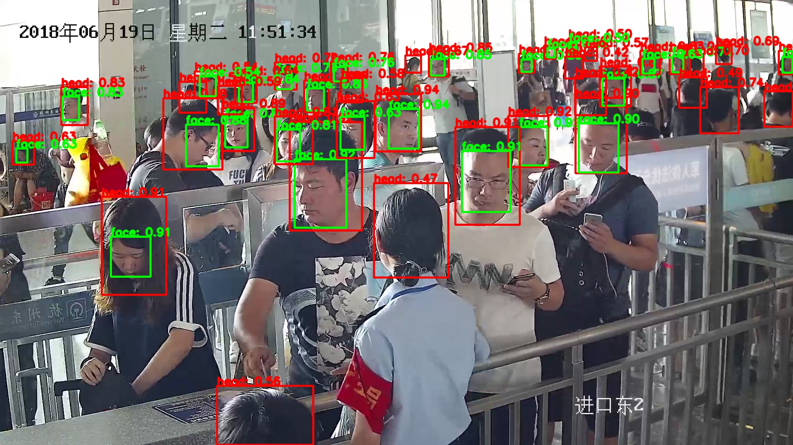

# Head And Face Simutaneously Detector
------ 
## Introduction
　　For the detection problem of the pairs which have fixed containment relationship, a novel method is proposed to avoid suppression problems between the pairs which occurs when only simple Yolo or SSD used
## Enviroment
    python 2.7
    tensorflow 1.3.0
## Model download
    Baidu netdisk link: https://pan.baidu.com/s/1oZ3pKzNo22vcg4LQ034X4Q Extraction code: ixu8
    Move the model files in downloaded checkpoint folder to the local checkpoint folder
## Predict
   Move the pictures which you would like to predict in the image/test folder
      python evaluate_image.py --head_or_face head    # only predict head
      python evaluate_image.py --head_or_face face    # only predict face
      python evaluate_image.py --head_or_face head_and_face    # predict both head and face 
## 
  
